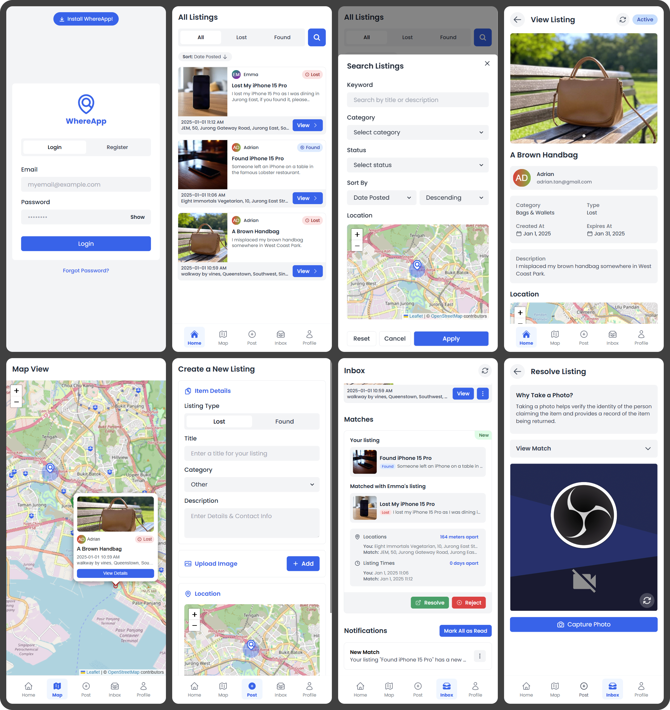

# 📱 WhereApp - Lost and Found Application

[](https://reactjs.org/)
[](https://www.typescriptlang.org/)
[](https://vitejs.dev/)
[](https://firebase.google.com/)
[](https://tailwindcss.com/)
[](https://chakra-ui.com/)
[](https://jotai.org/)
[](https://web.dev/progressive-web-apps/)
[](https://playwright.dev/)

## 🤔 What is WhereApp?

WhereApp is a Progressive Web Application (PWA) designed to streamline the lost and found process. It serves as a comprehensive platform for managing and tracking lost or found items, enabling users to efficiently report missing items, post found items, and facilitate the reunion of lost belongings with their rightful owners. The application combines both list and map views to create an intuitive and effective lost and found management system.

> This project is developed for the NTU Software Engineering Module Smart Nation Project.

## 📸 Screenshots



## 🌟 Features

- **Lost Item Reporting**: Easily report lost items with detailed descriptions
- **Found Item Posting**: Help others by posting items you've found
- **Interactive Map View**: Visual representation of lost and found items
- **Real-time Updates**: Instant notifications for potential matches
- **Progressive Web App**: Install and use like a native app
- **Responsive Design**: Works seamlessly on all devices

## 🚀 Getting Started

### Prerequisites

- Node.js (v14 or later)
- npm or yarn
- Git

### Installation

1. Clone the repository:
   ```bash
   git clone https://github.com/faqihxdev/where-app.git
   cd whereapp
   ```

2. Install dependencies:
   ```bash
   npm install
   ```

3. Set up Firebase:
   - Create a Firebase project at https://console.firebase.google.com/
   - Add a web app to your Firebase project
   - Copy the Firebase configuration
   - Create a `.env` file:
     ```env
     VITE_FIREBASE_API_KEY=your_api_key
     VITE_FIREBASE_AUTH_DOMAIN=your_auth_domain
     VITE_FIREBASE_PROJECT_ID=your_project_id
     VITE_FIREBASE_STORAGE_BUCKET=your_storage_bucket
     VITE_FIREBASE_MESSAGING_SENDER_ID=your_messaging_sender_id
     VITE_FIREBASE_APP_ID=your_app_id
     ```

4. Start the development server:
   ```bash
   npm run dev
   ```

## 🛠️ Tech Stack

### Frontend
- React with TypeScript
- Jotai for state management
- Tailwind CSS & Chakra UI for styling
- Heroicons for icons

### Backend
- Firebase (Firestore)

### Development & Build
- Vite
- Firebase Hosting
- Progressive Web App features
  - Service Workers
  - Manifest file

## 📁 Project Structure

```
/src
├── /components               # Reusable components
│   └── ListingForm.tsx
│   └── ...
├── /stores                   # Jotai atoms and state management
│   ├── imageStore.ts
│   ├── listingStore.ts
│   └── userStore.ts
│   └── ...
├── /utils                    # Utility functions
│   └── ...
├── /pages                    # Application pages
│   ├── EditListingPage.tsx
│   ├── PostPage.tsx
│   ├── ViewListingPage.tsx
│   └── ...
├── /styles                   # Global styles and Tailwind config
│   └── ...
├── /types                    # TypeScript type definitions
│   └── types.ts
│   └── ...
├── App.tsx                   # Main application component
└── main.tsx                  # Entry point
```

## 👨‍💻 Development Guide

### Development Workflow

1. Create a feature branch:
   ```bash
   git checkout -b feature/your-feature-name
   ```

2. Make your changes following the project standards

3. Test locally:
   - Run development server
   - Check for console errors
   - Verify feature functionality
   - Watch for the 🔥 (terminate if seen)

4. Format and lint:
   ```bash
   npm run lint
   npm run format
   ```

5. Commit and push:
   ```bash
   git commit -m "type: description"
   git push origin feature/your-feature-name
   ```

### Important Development Notes

- Use TypeScript for all new files and components.
- Utilize Jotai for state management. Add new atoms and selectors in the appropriate files under the `/stores` directory.
- Style components using Tailwind CSS classes. Use Chakra UI components for "bigger components".
- Keep components small and focused. Extract reusable logic into custom hooks or utility functions.
- Update `types.ts` when adding or modifying data structures.
- Follow the existing patterns in `ListingForm.tsx`, `EditListingPage.tsx`, and `PostPage.tsx` when creating new forms or pages.
- Use the `imageStore.ts` for handling image-related operations.
- Refer to `listingStore.ts` and `userStore.ts` for examples of how to structure Firestore interactions.

## 📝 License

This project is licensed under the MIT License - see the [LICENSE](LICENSE) file for details.

---

<div align="center">
Made with ❤️ by the WhereApp Team
</div>
